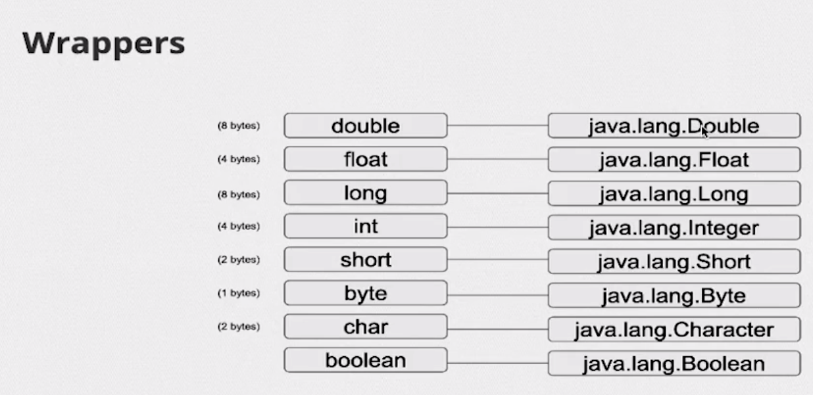
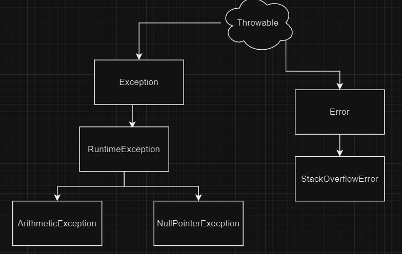

# Enum (enumeration)
- Define un conjunto de constantes que una variable podria tomar con nombres descriptivos a los valores constantes
- Premite constructores y metodos personalizados para agregar informacion adicional a la constante que tiene el enum.

# Records
- Utiles para casos en los que solo necesita almacenar y acceder datos simples
- Utiles como Dto.
- Son una clase que se introdujo en java 16.
- Se usan para representar tipos de datos inmutables.
- Solo almacenan valores y no tienen un comportamiento adicional.
- implementa automaticamente valores como equals(),hashCode(),toString().
- Permite metodos personalizados pero no es lo ideal.
# Interface Vs Abstract Class 
| Interface  | Abstract Class |
| ------------- | ------------- |
| Permite Herencia multiple | no permite Herencia multiple
| No permite implementaciones de metodos  |  si permite implementacione de metodos |
| No contiene constructor  | si permite tener constructor 👷 que puede ser accedido mediante super.|
| no tiene modificadores de acceso todo es plublico | si pude tener modificadores de acceso :accessibility: |
# Polimorfismo ✔️
Es la capacidad de un objeto de ser referenciado por varios tipos.
- podemos ver el polimorfismo de 3 formas:
- cuando una clase se extiende de otra.
- cuando una clase implementa una interfaz.
- cuando sobreEscirbimos un metodo. 
# herencia ventaja 
- La herencia captura lo que es común y aísla lo que es diferente entre clases.

# Interface ventajas 
- Garantiza que todos los métodos de clase que implementan una interfaz se puedan llamar de forma segura.
- Con composiciones e interfaces tendremos más flexibilidad con nuestro código, ya que no estaremos apegados al acoplamiento que propone la herencia.

# Algo de arrays 
- Un array es una estructura de datos y se usa para almacenar elementos (valores primitivos o referencias)
- Los arrays usan corchetes ([]) sintácticamente
- ¡Los arrays tienen un tamaño fijo!
- ¡Un array también es un objeto!
- Los arrays son zero-based(el primer elemento se encuentra en la posición 0)
- Un array siempre se inicializa con los valores padron.
- Al acceder a una posición no válida recibimos la excepción ArrayIndexOutOfBoundException
- Las matrices tienen un atributo length para conocer el tamaño
- La forma literal de crear un array, utilizando llaves {}.
# Casting y tipos implicito y explisito
# Casting implicito 🏳️ 
Es el casteo automatico cuando el lenguaje realiza la conversion de un tipo de datos a otro. en java se da cuando los datos primitivos tiene una jererquia  compatible es decir no hay perdida de infromacion en la conversion.
# Casteo de enteros:
  byte b = 10;
short s = b;   // Casting implícito de byte a short
int i = s;     // Casting implícito de short a int
long l = i;    // Casting implícito de int a long
# Casting punto flotante
- float y double el casting se da del mas pequeño float al mas grande double.
 float f = 10.5f;
double d = f;  // Casting implícito de float a double.
NOTA 📓 ☑️ :la pérdida de precisión cuando se realiza casting implícito entre enteros (int)  y de punto flotante, ya que los enteros no pueden representar fracciones exactas en algunos casos.
#  Casting explisito : 🚩
Es un casting forzado que se hace manualmente y puede haber perdida de informacion.
- Enteros :
int intValue = 100.
byte byteValue = (byte) intValue.   // Casting explícito de int a byte
short shortValue = (short) intValue. // Casting explícito de int a short
- Punto floante
double doubleValue = 10.5.
float floatValue = (float) doubleValue; // Casting explícito de double a float.
- Casting Caracteres 
char charValue = 'A'.
int intValue = (int) charValue;   // Casting explícito de char a int
# Vectores 
- Los vectores son un tipo de lista.
- Trabajan con threadSafe
- Los vectores se volieron obsoletos.
# Integer 
- Es la faroma de referenciar que nuestro objeto es numerico.
- No es un tipo primitivo por que es para referenciar objetos.
# AutoBoxing
- Es la forma en que java envuelve(Wrapper) sus tipos de datos primitivos con las referencias a objetos.
- Integer(Objeto) envuelve a int(primitivo).
# Unboxing
- Es la forma que java extrae un objeto y se lo pasa un tipo de dato primitivo.
Integer numeroObjeto = Integer.valueOf(40); (Objeto)
int valorPrimitivo= numeroObjeto; unboxing (Integer)objeto->primitivo.
- java lo hace por debajo con el metodo intValue().
- Lo mismo pasa con los tipos de datos numericos
byte byteInteger = numeroObjeto.byteValue().
double doubleInteger = numeroObjeto.doubleValue().
float floatInteger = numeroObjeto.floatValue().
# Wrappers
¡Son clases que contienen funcionalidades y encapsulan la variable de tipo primitivo!

# Exepciones
Son eventos que no dejan continunar  la ejecucion normal de un programa por un problema
En lugar de que el programa se bloquee o cierre inesperadamente, se pueden capturar y manejar 
las excepciones para tomar medidas adecuadas y proporcionar retroalimentación 
al usuario o realizar las acciones necesarias para resolver el problema.
- no se puede usar try si catch.
- puedo usar varios catch seguidos pero que capturen diferentes tipos de errores.
- Podemos capturar varias en un solo catch usando el operador | asi: 
- (ArithmeticException | StringException)
- Las excepciones no controladas caen en la pila de ejecución en busca de alguien
que pueda manejarlas.
- Toda excepción en Java tiene un nombre que la idenfica. Este enfoque hace que sea más fácil de entender que usar 
números mágicos (códigos de error) como 15, 7012 o 16.
# Lanzamiento de exepciones (throw)

Es en la clase Throwable donde tenemos casi todo el código relacionado con las excepciones, incluyendo getMessage() e
printStackTrace (). El resto de la jerarquía tiene solo algunas sobrecargas de constructores para comunicar mensajes 
específicos.

- Solo se pude hacer throw con objetos de tipo exepcion.
- Cuando se define un throw en el codigo se hasta ese momento continua el codigo
- Para lanzar una excepción, además de instanciarla, es necesario lanzarla a través del throw.
- Podemos asignar un mensaje a la excepción.
- no es necesario guardar la excepción en una referencia, pudiendo lanzarla directamente 
en una sola línea, por ejemplo: throw new ArithmeticException();

throw new ArithmeticException();
# Grupos de exepciones  y errores
- The Throwable class is the superclass of all errors and exceptions in the Java language.
- Puedo crear mis propias exepciones pero no pueden extender de throwable ni error.
- Las exepciones que cree deben extender de runtimeException.

# runtimeException (unchecked)
Cuando extiendo una exepcion de runtimeException debo usar try y catch para indicar a java
que puede o no que se lance una exepcion.

# Exception (checked)
- cuando extiendo de exception nesesito usar throws y miException porque esto le dice a java que con 
seguridad que si lanza esa exception.
- se ve en tiempo de compilacion y nos avisa  de que no se va a ejecutar el proyecto

# Error
es diferente a la expecion ya que el error no se puede manipular ni controlar como una expecion
se da cuando se llena la memoria por ejemplo cuando un metodo se llama asi mismo.

# Throw vs Throws
**Throws** (Lanzamientos)(checked)
- Se utiliza para indicar que el método no manejará directamente la excepción, 
sino que la propagará al código que llama al método
- Se coloca en la firma de un método para indicar que el método puede lanzar una o más excepciones.
- Puede haber varias excepciones mencionadas separadas por comas después de throws.

**Throw** (Lanzamiento)(unchecked)
- Es una sentencia que se utiliza para lanzar una excepción manualmente en un bloque de código.
- Se utiliza dentro de un bloque try para generar una excepción en función de una condición o situación específica.
- Puede lanzar cualquier tipo de excepción (que sea subclase de Throwable).
- Puede ser útil para crear excepciones personalizadas o para manejar situaciones específicas que requieran una excepción. 

Nota:
throws se utiliza en la firma del método para indicar las excepciones que el método podría lanzar,
mientras que throw se utiliza dentro del código del método para lanzar manualmente
una excepción en función de ciertas condiciones.

# Finally
Se usa junto con try y catch de forma opcional que va a ejecutar una instruccion independientemente
si se produce la exepcion o no.
- Garantizar la Ejecución: Asegura que ciertas instrucciones se ejecuten, incluso si se produce una excepción inesperada.
- se puede usar try junto con finally pero la exception no sera controlada porque falta el catch.
- normalmente se usa para cerrar un recurso.
 
