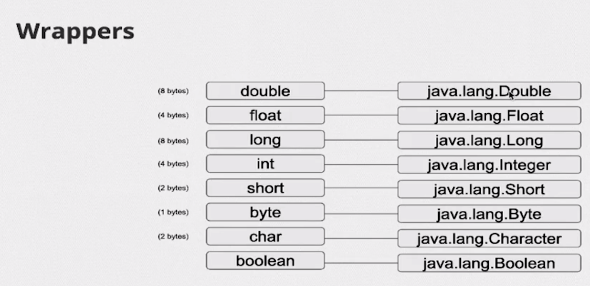

# Interface Vs Abstract Clas 
| Interface  | Abstract Class |
| ------------- | ------------- |
| Permite Herencia multiple | no permite Herencia multiple
| No permite implementaciones de metodos  |  si permite implementacione de metodos |
| No contiene constructor  | si permite tener constructor 👷 que puede ser accedido mediante super.|
| no tiene modificadores de acceso todo es plublico | si pude tener modificadores de acceso :accessibility: |
# Polimorfismo ✔️
Es la capacidad de un objeto de ser referenciado por varios tipos.
- podemos ver el polimorfismo de 3 formas:
- cuando una clase se extiende de otra.
- cuando una clase implementa una interfaz.
- cuando sobreEscirbimos un metodo. 
# herencia ventaja 
- La herencia captura lo que es común y aísla lo que es diferente entre clases.

# Interface ventajas 
- Garantiza que todos los métodos de clase que implementan una interfaz se puedan llamar de forma segura.
- Con composiciones e interfaces tendremos más flexibilidad con nuestro código, ya que no estaremos apegados al acoplamiento que propone la herencia.

# Algo de arrays 
- Un array es una estructura de datos y se usa para almacenar elementos (valores primitivos o referencias)
- Los arrays usan corchetes ([]) sintácticamente
- ¡Los arrays tienen un tamaño fijo!
- ¡Un array también es un objeto!
- Los arrays son zero-based(el primer elemento se encuentra en la posición 0)
- Un array siempre se inicializa con los valores padron.
- Al acceder a una posición no válida recibimos la excepción ArrayIndexOutOfBoundException
- Las matrices tienen un atributo length para conocer el tamaño
- La forma literal de crear un array, utilizando llaves {}.
# Casting y tipos implicito y explisito
# Casting implicito 🏳️ 
Es el casteo automatico cuando el lenguaje realiza la conversion de un tipo de datos a otro. en java se da cuando los datos primitivos tiene una jererquia  compatible es decir no hay perdida de infromacion en la conversion.
# Casteo de enteros:
  byte b = 10;
short s = b;   // Casting implícito de byte a short
int i = s;     // Casting implícito de short a int
long l = i;    // Casting implícito de int a long
# Casting punto flotante
- float y double el casting se da del mas pequeño float al mas grande double.
 float f = 10.5f;
double d = f;  // Casting implícito de float a double.
NOTA 📓 ☑️ :la pérdida de precisión cuando se realiza casting implícito entre enteros (int)  y de punto flotante, ya que los enteros no pueden representar fracciones exactas en algunos casos.
#  Casting explisito : 🚩
Es un casting forzado que se hace manualmente y puede haber perdida de informacion.
- Enteros :
int intValue = 100.
byte byteValue = (byte) intValue.   // Casting explícito de int a byte
short shortValue = (short) intValue. // Casting explícito de int a short
- Punto floante
double doubleValue = 10.5.
float floatValue = (float) doubleValue; // Casting explícito de double a float.
- Casting Caracteres 
char charValue = 'A'.
int intValue = (int) charValue;   // Casting explícito de char a int
# Vectores 
- Los vectores son un tipo de lista.
- Trabajan con threadSafe
- Los vectores se volieron obsoletos.
# Integer 
- Es la faroma de referenciar que nuestro objeto es numerico.
- No es un tipo primitivo por que es para referenciar objetos.
# AutoBoxing
- Es la forma en que java envuelve(Wrapper) sus tipos de datos primitivos con las referencias a objetos.
- Integer(Objeto) envuelve a int(primitivo).
# Unboxing
- Es la forma que java extrae un objeto y se lo pasa un tipo de dato primitivo.
Integer numeroObjeto = Integer.valueOf(40); (Objeto)
int valorPrimitivo= numeroObjeto; unboxing (Integer)objeto->primitivo.
- java lo hace por debajo con el metodo intValue().
- Lo mismo pasa con los tipos de datos numericos
byte byteInteger = numeroObjeto.byteValue().
double doubleInteger = numeroObjeto.doubleValue().
float floatInteger = numeroObjeto.floatValue().
# Wrappers
¡Son clases que contienen funcionalidades y encapsulan la variable de tipo primitivo!

 
